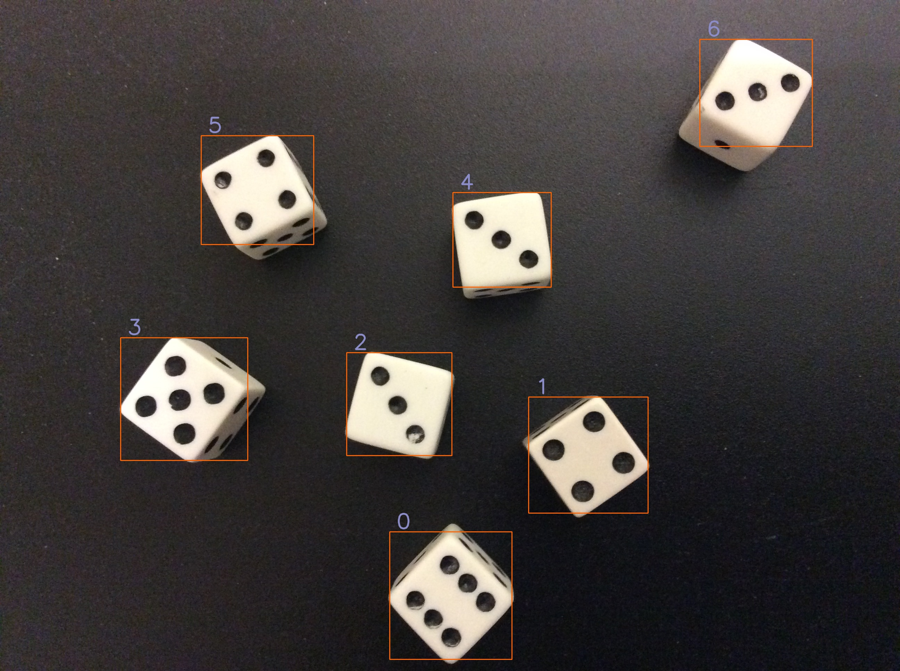
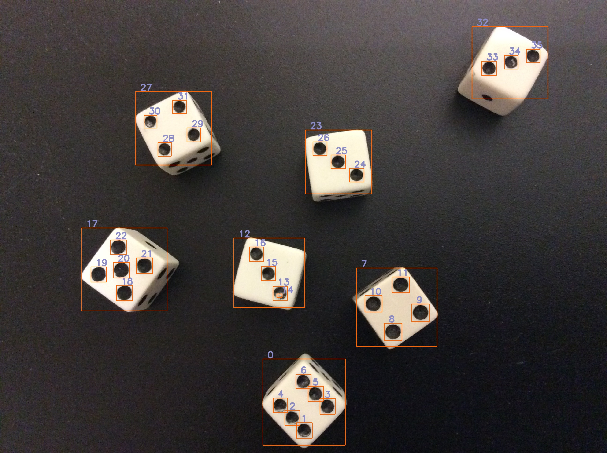
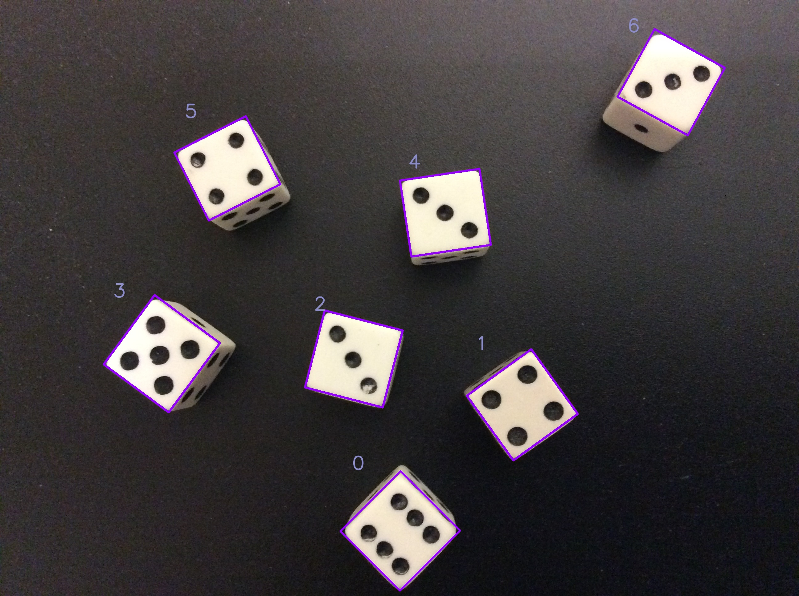

# OpenCV-Contours-Hierarchy
**This notebook will give you a brief idea about the OpenCV `findContours()` method & also put some light on Contours and Hierarchies associated with the `findContours()` method & different mode of operation like `RETR_EXTERNAL` & `RETR_TREE`.**
 
 

